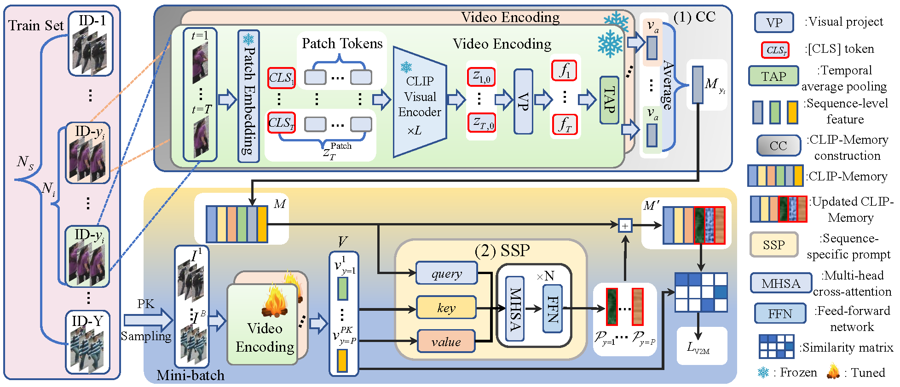

<div align=center>

</div>

<div align="center">
    <a href="https://pytorch.org"></a>
    <a href="https://arxiv.org/pdf/2312.09627.pdf"></a>
</div>

<div align=center>

</div>

Large-scale language-image pre-trained models (e.g., CLIP) have shown superior performances on many cross-modal retrieval tasks.
However, the problem of transferring the knowledge learned from such models to video-based person re-identification (ReID) has barely been explored.
In addition, there is a lack of decent text descriptions in current ReID benchmarks.
To address these issues, in this work, we propose a novel one-stage text-free CLIP-based learning framework named **TF-CLIP** for video-based person ReID.


## :loudspeaker:News
- [2024/01/01] We make TF-CLIP public. Happy New Year!!!

## :fire: Highlight

* We propose a novel one-stage text-free CLIP-based learning framework named **TF-CLIP** for video-based person ReID.
To our best knowledge, we are the first to extract identity-specific sequence features to replace the text features of CLIP.
Meanwhile, we further design a Sequence-Specific Prompt (SSP) module to update the CLIP-Memory online.

* We propose a Temporal Memory Diffusion (TMD) module to capture temporal information.
The frame-level memories in a sequence first communicate with each other to extract temporal information.
The temporal information is then further diffused to each token, and finally aggregated to obtain more robust temporal features.

<div align=center>

</div>

## :memo: Results

*  Performance
<div align=center>

</div>
*  Pretrained Models

- [x] MARS : [Model&Code](https://pan.baidu.com/s/1k4MR3w6NPiyA49FAB5aRlQ?pwd=1234) PASSWORD: 1234

- [x] LSVID : [Model&Code](https://pan.baidu.com/s/1prJcECyiiJsN-3wBRzdMjQ?pwd=1234) PASSWORD: 1234

- [x] iLIDS : [Model&Code](https://pan.baidu.com/s/1XEqOZQPMnsAUQN5jYMkrPg?pwd=1234) PASSWORD: 1234


*  t-SNE Visualization
<div align=center>

</div>

## :bookmark_tabs:Installation
* Install the conda environment
```
conda create -n tfclip python=3.8
conda activate tfclip
conda install pytorch==1.8.0 torchvision==0.9.0 torchaudio==0.8.0 cudatoolkit=10.2 -c pytorch
```
* Install the required packages:
```
pip install yacs
pip install timm
pip install scikit-image
pip install tqdm
pip install ftfy
pip install regex
```
* Prepare Datasets
```
Download the datasets (MARS, LS-VID and iLIDS-VID), and then unzip them to your_dataset_dir.
```

## :car:Run TF-CLIP
For example，if you want to run method on MARS, you need to modify the bottom of configs/vit_base.yml to
```
DATASETS:
   NAMES: ('MARS')
   ROOT_DIR: ('your_dataset_dir')
OUTPUT_DIR: 'your_output_dir'
```
Then, run
```
CUDA_VISIBLE_DEVICES=0 python train-main.py
```

## :car:Evaluation
For example, if you want to test methods on MARS, run
```
CUDA_VISIBLE_DEVICES=0 python eval-main.py
```

## :hearts: Acknowledgment
This project is based on [CLIP-ReID](https://github.com/Syliz517/CLIP-ReID) and [XCLIP](https://github.com/microsoft/VideoX/tree/master/X-CLIP).
Thanks for these excellent works.

## :hearts: Concat
If you have any questions, please feel free to send an email to yuchenyang@mail.dlut.edu.cn or asuradayuci@gmail.com. .^_^.

## :book: Citation
If you find TF-CLIP useful for you, please consider citing :mega:
```bibtex
@article{tfclip,
      Title={TF-CLIP: Learning Text-Free CLIP for Video-Based Person Re-identification},
      Author = {Chenyang Yu, Xuehu Liu, Yingquan Wang, Pingping Zhang, Huchuan Lu},
      Volume={38},
      Number={7},
      Pages = {6764-6772},
      Year = {2024},
      booktitle= = {AAAI}
}
```
## :book: LICENSE
TF_CLIP is released under the [MIT License](https://github.com/AsuradaYuci/TF-CLIP/blob/main/LICENSE).
